# Temporal Workflow — Complete Lifecycle From Time Zero (DocumentIndexingWorkflow)

Every interaction from the very start: Temporal server boot, queue creation,
how workflows/activities are (and are not) introduced to the server, service
startup, trigger, task queues, event persistence, execution, retries,
resume/replay, completion.

Cross-check against a real run: `temporal workflow show -w doc-index-DOC-777`
Inspect the queue: `temporal task-queue describe --task-queue DOCUMENT_INDEXING`

```mermaid
%%{init: {'theme': 'base', 'themeVariables': {
  'background': '#ffffff',
  'primaryColor': '#dbe7f5',
  'primaryTextColor': '#1a1a2e',
  'primaryBorderColor': '#4a6da7',
  'actorBkg': '#dbe7f5',
  'actorTextColor': '#1a1a2e',
  'actorBorder': '#4a6da7',
  'noteBkgColor': '#fff3c4',
  'noteTextColor': '#1a1a2e',
  'noteBorderColor': '#c9a94e',
  'signalColor': '#2f2f3a',
  'signalTextColor': '#1a1a2e',
  'labelTextColor': '#1a1a2e',
  'labelBoxBkgColor': '#e6e6ef',
  'labelBoxBorderColor': '#4a6da7',
  'loopTextColor': '#1a1a2e',
  'activationBkgColor': '#dbe7f5',
  'sequenceNumberColor': '#ffffff'
}}}%%
sequenceDiagram
    autonumber
    participant C as curl
    participant API as IndexController<br/>(your JVM)
    participant WC as WorkflowClient<br/>(your JVM)
    participant WW as Workflow Worker<br/>(your JVM)
    participant AW as Activity Worker<br/>(your JVM)
    participant FE as Frontend Service<br/>(Temporal server)
    participant MQ as Matching Service<br/>task queues
    participant HIS as History Service
    participant DB as Persistence<br/>(SQLite / Postgres)

    rect rgb(235, 235, 245)
    Note over FE,DB: PHASE A - TEMPORAL SERVER BOOT (temporal server start-dev)
    FE->>DB: connect, create/verify schema<br/>(namespaces, history shards, task queue and task tables)
    FE->>DB: ensure namespace "default" exists (dev server auto-creates)
    Note over FE,HIS: frontend + matching + history services start,<br/>gRPC listens on 7233, Web UI on 8233
    Note over MQ,HIS: ZERO task queues exist at this point -<br/>queues are never pre-configured,<br/>they materialize lazily on first use
    Note over FE,DB: the server will NEVER hold workflow<br/>or activity code - no deployment, no registration<br/>API, no schema of your types - it only ever sees<br/>type NAMES as strings inside events
    end

    rect rgb(240, 240, 240)
    Note over API,MQ: PHASE B - MICROSERVICE STARTUP, ALL REGISTRATION IS LOCAL
    Note over API,AW: Spring Boot starts, temporal-spring-boot-starter autoconfigures<br/>from spring.temporal.* properties
    WC->>FE: open gRPC channel to 127.0.0.1:7233<br/>(spring.temporal.connection.target)
    WC->>FE: GetSystemInfo + namespace check (default)
    Note over API,AW: starter scans org.kbase.ragindexer and builds<br/>IN-MEMORY maps in your JVM only:<br/>"DocumentIndexingWorkflow" -> impl class (@WorkflowImpl)<br/>"FetchDocument", "ProcessDocument",<br/>"GenerateEmbeddings", "StoreDocument"<br/>-> Spring beans (@ActivityImpl,<br/>stub or live per ragindexer.stub-mode)<br/>THE SERVER IS TOLD NOTHING
    WW->>FE: gRPC PollWorkflowTaskQueue(namespace=default,<br/>taskQueue=DOCUMENT_INDEXING)
    FE->>MQ: route poll to matching
    Note over FE,HIS: queue DOCUMENT_INDEXING not found -><br/>CREATED NOW, lazily: partition in memory,<br/>ownership lease + metadata written to DB
    MQ->>DB: persist task queue metadata (lease, ack levels)
    Note over MQ: poller parked, held up to 60s,<br/>worker re-issues it in a loop forever
    AW->>FE: gRPC PollActivityTaskQueue(DOCUMENT_INDEXING)
    FE->>MQ: park activity poller the same way
    end

    rect rgb(230, 240, 250)
    Note over C,DB: PHASE 1 - TRIGGER
    C->>API: POST /api/v1/documents/DOC-777/index
    API->>WC: WorkflowClient.start(workflow::index, DOC-777)
    WC->>FE: gRPC StartWorkflowExecution<br/>(workflowId=doc-index-DOC-777,<br/>workflowType="DocumentIndexingWorkflow" as a STRING,<br/>taskQueue, input payload)
    FE->>HIS: route to history shard owning this workflowId
    HIS->>DB: WRITE event 1 WorkflowExecutionStarted<br/>WRITE event 2 WorkflowTaskScheduled
    HIS->>MQ: transfer task: workflow task ready
    Note over MQ,DB: a parked poller is waiting -> SYNC MATCH,<br/>task handed over directly, skips the task table.<br/>No poller available -> task row WRITTEN TO DB (backlog)<br/>and delivered when a poller shows up
    FE-->>WC: ack (runId)
    API-->>C: 202 workflowId + runId (no code has run yet)
    end

    rect rgb(230, 250, 230)
    Note over WW,DB: PHASE 2 - FIRST WORKFLOW TASK (orchestration decision)
    MQ-->>WW: deliver workflow task
    HIS->>DB: WRITE event 3 WorkflowTaskStarted
    Note over WW: looks up "DocumentIndexingWorkflow" in its LOCAL registry,<br/>instantiates impl, executes index() from line 1.<br/>Unknown type would fail the task - this is the only<br/>place type names are ever validated
    Note over WW: code reaches activities.fetchDocument(...) -><br/>stub records a command and pauses the code
    WW->>FE: RespondWorkflowTaskCompleted<br/>commands=[ScheduleActivityTask "FetchDocument"]
    FE->>HIS: apply commands
    HIS->>DB: WRITE event 4 WorkflowTaskCompleted<br/>WRITE event 5 ActivityTaskScheduled<br/>(name, input, timeouts, retryPolicy)
    HIS->>MQ: transfer task: activity task ready
    end

    rect rgb(250, 245, 225)
    Note over AW,DB: PHASE 3 - ACTIVITY EXECUTION (real work)
    MQ-->>AW: deliver activity task (name + args + policy)
    HIS->>DB: WRITE event 6 ActivityTaskStarted (attempt 1)
    Note over AW: looks up "FetchDocument" in LOCAL registry -><br/>finds the Spring bean (stub or live), deserializes DOC-777,<br/>invokes the real Java method
    alt activity throws (transient failure)
        AW->>FE: RespondActivityTaskFailed
        Note over MQ,HIS: NO history event per attempt - counter kept in<br/>mutable state, server timer waits backoff (2s, 4s, 8s...),<br/>re-enqueues - workflow code never involved
        MQ-->>AW: redeliver (attempt N+1)
        AW->>FE: RespondActivityTaskCompleted (eventually)
    else activity returns normally
        AW->>FE: RespondActivityTaskCompleted<br/>result raw-content-of-DOC-777
    end
    FE->>HIS: activity done
    HIS->>DB: WRITE event 7 ActivityTaskCompleted (result)<br/>WRITE event 8 WorkflowTaskScheduled
    HIS->>MQ: workflow task ready (sticky queue -<br/>prefers the worker holding the cached run)
    end

    rect rgb(230, 250, 230)
    Note over WW,DB: PHASE 4 - WORKFLOW RESUMES
    MQ-->>WW: deliver workflow task
    alt sticky cache hit (normal case)
        Note over WW: run cached in memory - index() resumes where it<br/>paused, fetchDocument returns the recorded result
    else cache miss (worker restarted / crashed)
        WW->>FE: GetWorkflowExecutionHistory
        FE-->>WW: full event history
        Note over WW: REPLAY: re-runs index() from line 1, completed calls<br/>return memoized results from history, nothing re-executes
    end
    WW->>FE: RespondWorkflowTaskCompleted<br/>commands=[ScheduleActivityTask "ProcessDocument"]
    end

    rect rgb(245, 235, 250)
    Note over WW,DB: PHASE 5 - CYCLE REPEATS PER ACTIVITY
    loop ProcessDocument, then GenerateEmbeddings, then StoreDocument
        HIS->>DB: WRITE ActivityTaskScheduled
        HIS->>MQ: enqueue activity task
        MQ-->>AW: deliver
        HIS->>DB: WRITE ActivityTaskStarted
        AW->>FE: RespondActivityTaskCompleted (result)
        HIS->>DB: WRITE ActivityTaskCompleted<br/>WRITE WorkflowTaskScheduled
        MQ-->>WW: deliver workflow task
        WW->>FE: RespondWorkflowTaskCompleted (next command)
    end
    end

    rect rgb(250, 230, 230)
    Note over WW,DB: PHASE 6 - COMPLETION
    Note over WW: index() returns store://rag-index/DOC-777 -<br/>no more commands to schedule
    WW->>FE: RespondWorkflowTaskCompleted<br/>commands=[CompleteWorkflowExecution result]
    HIS->>DB: WRITE event 29 WorkflowExecutionCompleted
    Note over DB: full history retained for the retention period -<br/>queryable via UI, CLI, GetWorkflowExecutionHistory
    Note over MQ,DB: queue lives while pollers keep polling -<br/>an idle queue with no pollers and no backlog is<br/>unloaded from memory, metadata stays in DB
    end
```

## How things come into existence

- **The server never learns your workflow or activity definitions.** There is
  no deploy step, no registration API. Registration (Phase B) builds in-memory
  maps inside YOUR JVM only: type-name string -> Java class/bean. The server
  passes those names around as opaque strings; the only place a name is ever
  resolved to code is a worker looking it up in its own local map. Unknown
  name = the task fails on that worker and gets retried (possibly on a newer
  deployment that does know it).
- **Task queues are created lazily, not configured.** The first poll (or first
  dispatch) with a new queue name makes the matching service materialize it:
  an in-memory partition plus a small metadata/lease record in the DB. Typo a
  queue name and you silently get a brand-new empty queue - which is exactly
  why `TaskQueues.DOCUMENT_INDEXING` is a shared constant.
- **Tasks touch the DB only when nobody is waiting.** If a poller is parked,
  the task is handed to it directly (sync match) and never becomes a task-table
  row. With no poller, the task is persisted as backlog and delivered later.
  Correctness never depends on this: the event history (always written first)
  is the source of truth, task delivery is merely a notification.

## Key takeaways

- The 202 response returns before any workflow code has run - the trigger is
  a durable write, execution is fully decoupled.
- Every state transition is: write history events first, notify queue second.
  Lost deliveries are redelivered from state - nothing is lost.
- The microservice appears as four independent actors: controller + client
  only start things, the two workers only pull and respond. The server never
  calls into the app.
- Workflow tasks are "decide" steps (produce commands), activity tasks are
  "do" steps (produce results). The server alternates between them until the
  final command is CompleteWorkflowExecution.
- Activity retries (Phase 3 alt-block) run entirely between matching, the
  backoff timer, and the activity worker - the workflow worker never
  participates, so completed steps are never re-executed during retries.
- Resume after a crash = replay (Phase 4 alt-block): workflow code re-runs
  from line 1 but completed activity calls return memoized results from
  history. This is why workflow code must be deterministic.
